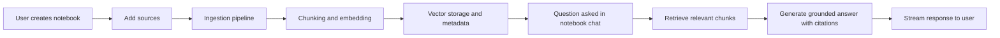

# ChatSource

         

ChatSource is a notebook based RAG platform for turning your own sources into grounded AI answers. It helps you collect documents, website links, and raw text into isolated notebooks, then ask questions that are answered with citations back to the original material.

This project is built as a full stack application with a Next.js frontend and an Express backend. The backend handles authentication, ingestion, vector search, and streaming chat generation. The result is a product that feels close to a private research copilot for your own knowledge base.

## Why this project exists

Most AI tools are great at answering from general knowledge, but they often struggle when you need answers grounded in your own documents. ChatSource tries to fix that by combining:

- private notebook organization
- multi source ingestion
- chunking and vector search
- citation aware answer generation
- real time streaming chat experience

The experience is designed for people who want evidence, not vague guesses.

## What the product does

With ChatSource, you can:

- create notebooks for different topics or projects
- add sources from PDF files, website URLs, or raw text
- process those sources in the background
- ask questions across all ready sources in a notebook
- receive streaming answers with source citations
- review the grounding trail for each answer

## How it works

The system follows a simple flow:



The main pieces are:

1. The client app lets users sign in, create notebooks, add sources, and chat.
2. The server exposes secure API routes for notebooks, sources, and chat.
3. A worker process handles async ingestion and answer generation jobs.
4. The database stores notebook, source, chunk, and chat history data.
5. Vector storage is used to retrieve the most relevant content for a question.

## Tech stack

- Next.js
- React
- TypeScript
- Tailwind CSS
- shadcn/ui
- Clerk for authentication
- Express
- Prisma with PostgreSQL
- Redis and BullMQ for async jobs
- Qdrant for vector search
- Supabase for storage
- OpenAI and Gemini for generation and embeddings

## Project structure

```text
client/          Frontend application built with Next.js and shadcn/ui
server/          Backend API, worker processes, Prisma schema, and services
```

### Client

The client app is organized around:

- authentication and routing
- notebook management pages
- source management dialogs and lists
- chat UI with streaming responses
- API helpers for communicating with the backend

### Server

The server contains:

- Express routes for notebooks, sources, and chat
- Prisma models for notebooks, sources, chunks, and chat sessions
- ingestion services for parsing and embedding content
- queue based workers for background processing
- storage integration for uploaded files

## Local development

### Prerequisites

You will need:

- Node.js 20 or newer
- npm
- PostgreSQL
- Redis
- Qdrant instance
- Supabase project for file storage
- Clerk account for authentication
- Gemini API key and optional OpenAI key

### 1. Install dependencies

```bash
cd client
npm install

cd ../server
npm install
```

### 2. Prepare the database

From the server folder, run:

```bash
npx prisma generate
npx prisma db push
```

### 3. Configure environment variables

Create environment files for the client and server.

Client environment example:

```env
NEXT_PUBLIC_CLERK_PUBLISHABLE_KEY=your_clerk_publishable_key
CLERK_SECRET_KEY=your_clerk_secret_key
NEXT_PUBLIC_CLERK_SIGN_IN_URL=/sign-in
NEXT_PUBLIC_CLERK_SIGN_UP_URL=/sign-up
NEXT_PUBLIC_API_BASE_URL=http://localhost:5000
```

Server environment example:

```env
PORT=5000
CLIENT_ORIGIN=http://localhost:3000
DATABASE_URL=your_postgres_connection_string
REDIS_URL=your_redis_connection_string
QDRANT_URL=your_qdrant_url
QDRANT_API_KEY=your_qdrant_api_key
R2_ACCOUNT_ID=your_r2_account_id
R2_ACCESS_KEY_ID=your_r2_access_key_id
R2_SECRET_ACCESS_KEY=your_r2_secret_access_key
R2_BUCKET_NAME=your_r2_bucket_name
R2_ENDPOINT=your_r2_endpoint
CLERK_SECRET_KEY=your_clerk_secret_key
CLERK_PUBLISHABLE_KEY=your_clerk_publishable_key
SUPABASE_URL=your_supabase_url
SUPABASE_SERVICE_ROLE_KEY=your_supabase_service_role_key
SUPABASE_STORAGE_BUCKET=your_supabase_bucket
GEMINI_API_KEY=your_gemini_api_key
GEMINI_MODEL_CHAT=gemini-3.5-flash
OPENAI_API_KEY=your_openai_key
OPENAI_EMBEDDING_MODEL=text-embedding-3-small
OPENAI_MODEL_CHAT=gpt-4o-mini
```

### 4. Start the app

Start the frontend:

```bash
cd client
npm run dev
```

Start the backend API:

```bash
cd server
npm run dev:api
```

Start the worker process:

```bash
cd server
npm run dev:worker
```

Once everything is running, open:

- http://localhost:3000 for the client
- http://localhost:5000 for the API health check

## Development notes

A few design choices are worth knowing:

- The app uses Clerk for authentication and keeps data scoped by user id.
- Notebook and source access is enforced at the API layer.
- Ingestion runs asynchronously so uploads do not block the UI.
- Chat answers stream token by token over Server Sent Events.
- Each answer is tied to source evidence through citation metadata.

## Suggested workflow

If you are exploring the project for the first time, this is the best path:

1. Sign in to the app.
2. Create a notebook.
3. Add a PDF, website, or text source.
4. Wait for the ingestion pipeline to complete.
5. Open the chat view and ask a grounded question.

## Future direction

This project has a strong base for a private research assistant. Future improvements could include:

- better source preview and extraction quality
- richer citation UI
- more ingestion formats
- stronger ranking and retrieval tuning
- improved admin and analytics views

## License

This project is currently intended for internal or personal use. Add your preferred license text if you plan to share it publicly.
