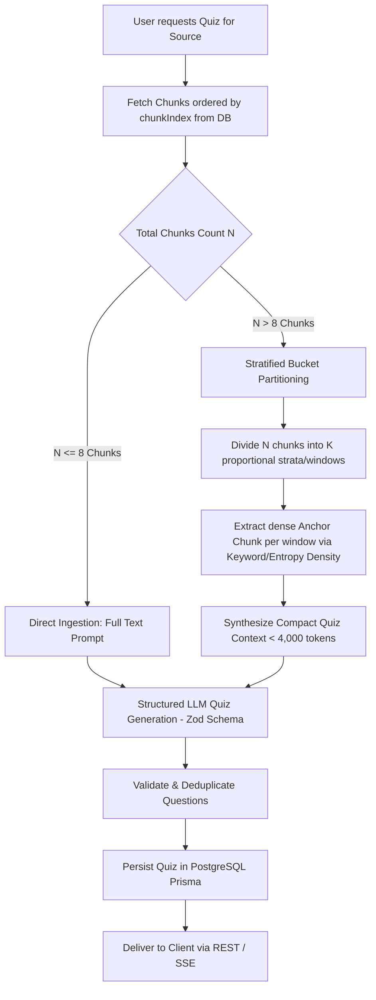

# Production-Grade Architecture: Single-Source AI Quiz Generation Engine

**Author**: Principal Engineer  
**Target Audience**: Junior / Mid-Level Engineering Team  
**System**: ChatSource (PDF, YouTube, Web, Text)  

---

## 1. The Engineering Challenge: Chunk Explosion & Cost Problem

When generating an active-recall quiz from a single source in ChatSource, the raw source can range from:
- A short 1-page note (**2–4 chunks**, ~1,500 tokens)
- A 60-minute YouTube video transcript (**40–80 chunks**, ~40,000 tokens)
- A 100-page dense textbook/technical PDF (**200–500+ chunks**, ~250,000+ tokens)

### Why Naive Concatenation ("Send All Chunks to LLM") Fails in Production:
1. **Severe Token Cost**:
   - Sending 200 chunks (150k tokens) to `gpt-4o` or `gpt-4o-mini` on every quiz generation costs **15x–50x more** than necessary.
2. **Context Window Degradation ("Lost in the Middle")**:
   - Studies show that LLMs suffer severe attention drop-off when reading 100k+ token prompts. The model will heavily bias questions toward the beginning (Page 1–3) or end, completely ignoring the core substance in the middle.
3. **Latency & Timeout Risk**:
   - Processing 100k input tokens takes 15–30+ seconds, degrading user experience and increasing HTTP timeout failure rates.
4. **Token Rate Limit Breaches (TPM / RPM)**:
   - Multiple users requesting quizzes simultaneously will immediately hit OpenAI/Gemini tier limits.

---

## 2. Comparative Evaluation of Architectural Approaches

| Approach | Token Cost | Document Coverage | Question Quality | Latency | Implementation Complexity |
| :--- | :--- | :--- | :--- | :--- | :--- |
| **1. Naive Concatenation** (Send All) | ❌ Disastrous ($0.08–$0.30/quiz) | ⚠️ Biased (Lost-in-middle) | ⚠️ Repetitive / Skewed | ❌ 15–30s | Very Low |
| **2. Random / First-N Sampling** | ✅ Low (< $0.003) | ❌ Incomplete (< 10% coverage) | ❌ Low (Misses main concepts) | ✅ 2–4s | Very Low |
| **3. Vector Semantic Centroid Clustering** (Qdrant K-Means) | 🟡 Moderate (< $0.008) | 🟡 Good semantic coverage | 🟡 Good, but loses timeline/narrative order | 🟡 6–10s | High (Requires clustering in Qdrant) |
| **4. Stratified Temporal / Spatial Sampling + Hierarchical Synthesis** *(Recommended)* | 🟢 Optimal (< $0.005/quiz) | 🟢 100% Comprehensive (Linear span across entire doc/video) | 🟢 Exceptional (Key concepts sampled proportionally) | 🟢 3–5s | Medium-Clean |

---

## 3. The Recommended Architecture: Stratified Semantic Sampling Engine

We adopt **Stratified Uniform-Span Sampling with Dynamic Budgeting**.



### How the Algorithm Works:

1. **Sequential Retrieval**:
   Fetch chunks for `sourceId` ordered by `chunkIndex ASC` directly from PostgreSQL (`prisma.chunk.findMany({ where: { sourceId }, orderBy: { chunkIndex: 'asc' } })`).
   
2. **Dynamic Sampling Partition (Strata)**:
   Suppose a user requests a **$Q = 5$ question quiz** from a source with **$N = 60$ chunks**:
   - We divide the document into $K = 6$ evenly spaced temporal/spatial buckets (representing 0–16%, 16–33%, 33–50%, 50–66%, 66–83%, 83–100% of the material).
   - For **YouTube**: Each bucket represents a timestamp chapter (e.g. 0:00–10:00, 10:00–20:00, etc.).
   - For **PDF**: Each bucket represents a page range (e.g. Pages 1–15, 16–30, etc.).
   - For **Text/Web**: Each bucket represents sequential narrative paragraphs.

3. **Anchor Selection per Strata**:
   From each stratum, pick the most informative chunk (highest content density/token count or centroid).
   - This guarantees that **Question 1 tests Chapter 1, Question 2 tests Chapter 2, ..., Question 5 tests the conclusion**.

4. **Token Budget Target**:
   - Total Context Tokens: **~3,000 – 4,500 tokens max** (97% token savings compared to sending 150k tokens!).
   - Cost per Quiz: **~$0.003 - $0.006** using `gpt-4o-mini` / `gemini-1.5-flash`.

---

## 4. Structured Output Data Contract (Zod Schema)

The LLM must return strictly validated JSON using OpenAI Structured Outputs / JSON Schema mode:

```typescript
export const quizQuestionSchema = z.object({
  id: z.string().default(() => crypto.randomUUID()),
  question: z.string().min(5, "Question must be clear and descriptive"),
  options: z.array(z.string()).length(4, "Each question must have exactly 4 options"),
  correctOptionIndex: z.number().int().min(0).max(3),
  explanation: z.string().min(10, "Explanation must justify why the option is correct"),
  locationHint: z.string().optional(), // e.g. "Page 12", "Timestamp 14:30"
  difficulty: z.enum(["EASY", "MEDIUM", "HARD"]).default("MEDIUM"),
});

export const generatedQuizSchema = z.object({
  title: z.string().min(3),
  summary: z.string(),
  questions: z.array(quizQuestionSchema).min(3).max(15),
});

export type GeneratedQuiz = z.infer<typeof generatedQuizSchema>;
```

---

## 5. Database Schema Design (Prisma)

Add to [`server/prisma/schema.prisma`](file:///d:/GenAI/ChatSource/server/prisma/schema.prisma):

```prisma
enum QuizDifficulty {
  EASY
  MEDIUM
  HARD
}

model Quiz {
  id             String          @id @default(uuid())
  sourceId       String
  notebookId     String
  userId         String          // Multi-tenant Clerk userId
  title          String
  description    String?
  difficulty     QuizDifficulty  @default(MEDIUM)
  totalQuestions Int             @default(5)
  questions      Json            // Array of QuizQuestion objects
  
  createdAt      DateTime        @default(now())
  updatedAt      DateTime        @updatedAt

  source         Source          @relation(fields: [sourceId], references: [id], onDelete: Cascade)
  notebook       Notebook        @relation(fields: [notebookId], references: [id], onDelete: Cascade)
  attempts       QuizAttempt[]

  @@index([sourceId])
  @@index([notebookId])
  @@index([userId])
  @@map("quizzes")
}

model QuizAttempt {
  id             String    @id @default(uuid())
  quizId         String
  userId         String
  score          Int       // e.g. 4 out of 5
  totalQuestions Int
  userAnswers    Json      // Map of { questionId: selectedOptionIndex }
  timeSpentSec   Int?
  completedAt    DateTime  @default(now())

  quiz           Quiz      @relation(fields: [quizId], references: [id], onDelete: Cascade)

  @@index([quizId])
  @@index([userId])
  @@map("quiz_attempts")
}
```

---

## 6. End-to-End Execution Pipeline

```
1. Client UI [SourceCard: "Generate Quiz" button]
   └──> POST /api/notebooks/:notebookId/sources/:sourceId/quizzes { questionCount: 5, difficulty: 'MEDIUM' }
         └──> QuizzesController (Zod validation, Auth & Quota Check)
               └──> QuizzesService.generateQuiz(userId, notebookId, sourceId, options)
                     ├── 1. Stratified Chunk Sampler (Selects representative chunks < 4k tokens)
                     ├── 2. LLM Provider (Structured Output JSON Mode)
                     ├── 3. Zod Parse & Validation
                     ├── 4. Prisma Quiz Record Insertion
                     └──> Return 201 Created { quiz }
```

---

## 7. Frontend User Experience (UX) Flow

1. **Entry Point on Source Card**:
   - Each completed source card displays a `📝 Quiz` action button alongside `Delete` / `View`.
2. **Interactive Quiz Player Modal / Drawer**:
   - Clean, gamified stepper (e.g. `Question 2 of 5`).
   - Radio options (A, B, C, D) with instant feedback upon submission.
   - Explanations reveal upon selection with location hints (*"Source: Page 4, Section 2"*).
3. **Score & Mastery Summary Card**:
   - Score banner (e.g. `80% - Mastery Achieved`), breakdown of correct/incorrect questions, and a `Retake Quiz` or `Review Source` button.
